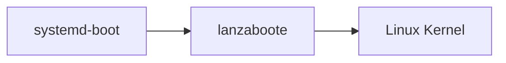

# Lanzaboote

🚧🚧🚧 **This is not working yet. Come back later.** 🚧🚧🚧

This repository contains experimental tooling for Secure Boot on
[NixOS](https://nixos.org/).

## High-Level Boot Flow

## lanzatool

`lanzatool` is a Linux command line application that takes a
[bootspec](https://github.com/NixOS/rfcs/pull/125) document and
installs the boot files into the UEFI
[ESP](https://en.wikipedia.org/wiki/EFI_system_partition).

To make systemd-boot recognize a new boot target, `lanzatool` builds a
[UKI](https://wiki.archlinux.org/title/Unified_kernel_image) image. To
avoid having to embed kernel and initrd, we use a custom stub
`lanzaboote` (see below) that loads kernel and initrd from the ESP.

## lanzaboote

`lanzaboote` is the stub that `lanzatool` uses to form an UKI. It
loads a Linux kernel and initrd without breaking the Secure Boot chain
of trust. Instead of rolling our own crypto, `lanzaboote` re-uses the
signature verification that is built-in to UEFI.

## Relevant Nixpkgs Work

This project depends on upstream nixpkgs work:

- https://github.com/NixOS/nixpkgs/pull/191665
- https://github.com/DeterminateSystems/bootspec-secureboot/
- https://github.com/DeterminateSystems/bootspec

You can find everything integrated as PoC
[here](https://github.com/NixOS/nixpkgs/pull/202497).
