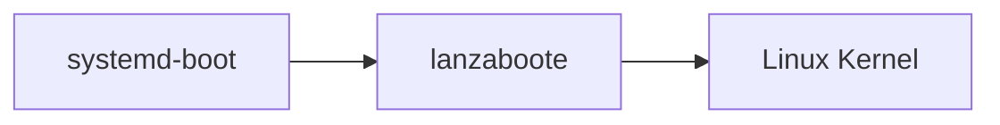

# Lanzaboote: Secure Boot for NixOS

🚧🚧🚧 **This is not ready for non-developer usage.** 🚧🚧🚧

This repository contains experimental tooling for Secure Boot on
[NixOS](https://nixos.org/).

## 🪛 To Do 🪛

There is a bunch of work to do. Please coordinate in the [Matrix
room](https://matrix.to/#/#nixos-secure-boot:ukvly.org), if you want
to take something up:

- Overview documentation about the approach
- Document a experimental setup for developers on how to use this repository
- Coordinate with bootspec RFC stakeholders to communicate a experience report on the bootspec usage
- Cleaning up flakes.nix for AArch64
- Upstream nixpkgs work
  - Lanzatool
  - Lanzaboote (needs unstable Rust!)
  - NixOS boot loader installation etc.
- Unit testing for Lanzatool
- Investigating how this can fit into systemd-boot theory about sysexts for initrds while keeping NixOS semantics
- Threat modelling explanations: "bring your own PKI", "share your PKI with MSFT CA", "bring rhboot shim with MOK", etc.
- Ensuring 99 % of the paths are "happy paths" : protecting user against bricking their machines, identifying sources of risk, communicating intent and detecting risks
- Experimenting with `fwupd` / Green Checkmark in GNOME Device Security
  - https://github.com/fwupd/fwupd/issues/5284
- Experimenting with TPM2 measurements
- Support bootspec with no initrd
- Studying the initrd secrets feature in NixOS wrt SecureBoot & TPM2
- ...

## High-Level Boot Flow

## lanzatool

`lanzatool` is a Linux command line application that takes a
[bootspec](https://github.com/NixOS/rfcs/pull/125) document and
installs the boot files into the UEFI
[ESP](https://en.wikipedia.org/wiki/EFI_system_partition).

To make systemd-boot recognize a new boot target, `lanzatool` builds a
[UKI](https://wiki.archlinux.org/title/Unified_kernel_image) image. To
avoid having to embed kernel and initrd, we use a custom stub
`lanzaboote` (see below) that loads kernel and initrd from the ESP.

Remaining items to implement are:

- Migrations from non-SecureBoot machine (old generation files) ;
- Alternative Nix stores paths ;
- Key rotation support ;
- Bootspec (abuse) cleanups ;
- Automatic synchronization policies for changing PKI (rotating keys, re-enrolling them, etc.) ;
- NixOS specialisations support ;
- Automatic removal of unused files relative to the `configurationLimit` option ;
- `os-release` patch so `systemd-boot` shows pretty names with generation number

## lanzaboote

`lanzaboote` is the stub that `lanzatool` uses to form an UKI. It
loads a Linux kernel and initrd without breaking the Secure Boot chain
of trust. Instead of rolling our own crypto, `lanzaboote` re-uses the
signature verification that is built-in to UEFI.

Remaining items to implement are:

- TPM measurements like `systemd-stub` does
- Better error management

## Relevant Nixpkgs Work

This project depends on upstream nixpkgs work:

- https://github.com/NixOS/nixpkgs/pull/191665
- https://github.com/DeterminateSystems/bootspec-secureboot/
- https://github.com/DeterminateSystems/bootspec

You can find everything integrated as PoC
[here](https://github.com/NixOS/nixpkgs/pull/202497).
